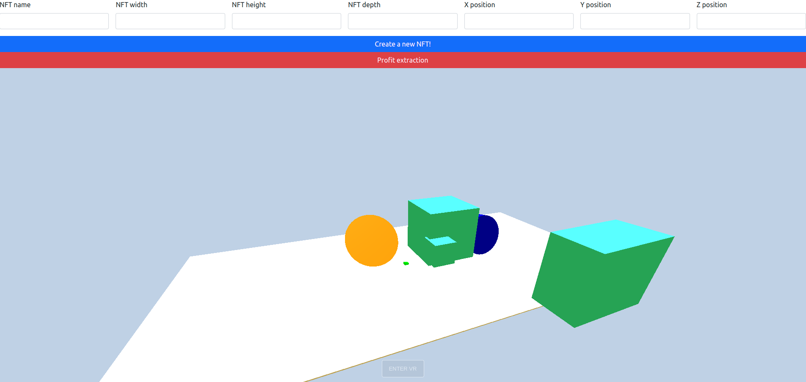
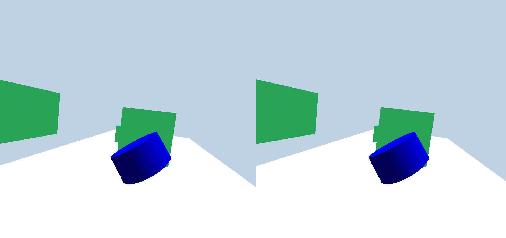

## Metaverse

Metaverse is a concept that denotes the next generation of the internet, which describes an immersive and multi-sensory experience in the applied use of various devices and technological developments on the internet.

In this project, we will be using the Metaverse concept to create a virtual world prototype. All of this using Three.js, Smart Contracts in Solidity and NFT Tokens.

## VR Support

This project can be used in VR mode. To do this, you must have a VR headset and a browser that supports WebXR.

## How to run

To run this project, you must run a local server. You can use the Live Server extension for VSCode or any other local server. Metamask is required too.